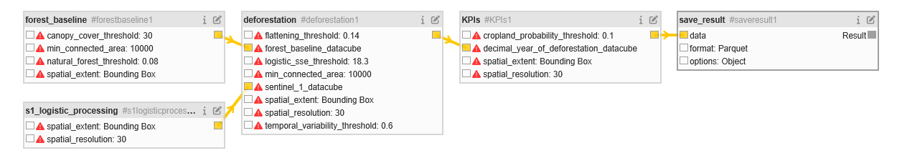

# LEON P6 OpenEO Implementation

We break up the end-to-end workflow into 4 modular User-Defined Processes (UDPs).
Each UDP lives in its own directory and can be run on its own.



## forest_baseline

Constructs a 2020 natural-forest pixel mask. 
A pixel is forest where natural-forest likelihood, canopy cover, and WorldCover class all pass their thresholds, 
and the connected patch is at least `min_connected_area`. 

Input datasets:
- Natural Forests of the World 2020 probability (external dataset)
- ESA_WORLDCOVER_10M_2020_V1
- CLMS_TCD_PANTROPICAL_10M_YEARLY_V1

Output dataset:
- Single-band mask: 1 = natural forest, 0 = non-forest

## s1_logistic_processing

Loads Sentinel-1 GRD VH backscatter, applies Lee and multitemporal speckle filters, 
resamples to the working resolution, and converts to dB. 
For each pixel it computes temporal standard deviation, 5th and 95th percentiles, and the best logistic-curve fit to a sudden drop in backscatter.

Input datasets:
- SENTINEL1_GRD

Output dataset:
- Bands are `sd`, `p05`, `p95`, `min_sse` (fit quality), and `min_sse_t` (decimal year of the best-fit event).

## deforestation

Takes the forest baseline and Sentinel-1 logistic-fit datacubes and detects when forest was lost. 
It keeps only baseline-forest pixels whose time series looks like a real deforestation event: 
enough temporal variability, enough backscatter flattening, and a logistic fit below the SSE threshold. 
Remaining forest patches smaller than `min_connected_area` are filled from nearest valid neighbours.

Input datasets:
- forest_baseline
- s1_logistic_processing

Output dataset:
- Bands are `year_of_deforestation` (decimal year) and `forest_baseline`.

## KPIs

Aggregates the deforestation rasters to Uganda ADM-4 administrative units. 
It thresholds cropland probability into a cropland mask, 
builds annual deforestation masks for 2020–2024 (and the subset that overlaps cropland), 
converts pixels to hectares, and sums over each ADM-4 geometry.

Input datasets:
- deforestation
- Google Dynamic World, cropland probability (external dataset)
- Uganda ADM-4 boundaries (geoBoundaries)

Output dataset:
- Vector cube with `forest_stock_baseline_ha`, `deforestation_{year}_ha`, and `forest_loss_to_cropland_{year}_ha` per administrative unit.

# Project Structure

```bash
$ tree .
.
├── aux-data
│   └── ...
├── deforestation
│   ├── run-udp.ipynb
│   ├── script.ipynb
│   ├── udp.ipynb
│   ├── udp.json
│   └── utils -> ../utils/
├── end-to-end
│   ├── inspect_parquet.ipynb
│   ├── run-udp.ipynb
│   ├── script.ipynb
│   ├── udp.ipynb
│   ├── udp.json
│   └── utils -> ../utils/
├── environment.yml
├── forest-baseline
│   ├── run-udp.ipynb
│   ├── script.ipynb
│   ├── udp.ipynb
│   ├── udp.json
│   └── utils -> ../utils
├── kpis
│   ├── inspect_parquet.ipynb
│   ├── run-udp.ipynb
│   ├── script.ipynb
│   ├── udp.ipynb
│   ├── udp.json
│   └── utils -> ../utils/
├── readme.md
├── s1-processing
│   ├── run-udp.ipynb
│   ├── script.ipynb
│   ├── udp.ipynb
│   ├── udp.json
│   └── utils -> ../utils
├── test-udf
│   └── ...
├── udf
│   └── ...
└── utils
    └── ...
```

The four UDPs live in `forest-baseline/`, `s1-processing/`, `deforestation/`, and `kpis/`.

`end-to-end/` composes those four into the full process graph.

Each UDP directory has the same layout:

- `udp.ipynb` — builds the User-Defined Process
- `udp.json` — exported process graph (this is the UDP)
- `script.ipynb` — the same workflow as an inline script, without wrapping it as a UDP
- `run-udp.ipynb` — runs the UDP against the OpenEO backend
- `utils` — symlink to the shared `utils/` package at the repo root (`udp_params`, STAC/UDP URLs, helpers)

`udf/` holds Python User-Defined Functions used inside the process graphs.
`test-udf/` holds unit tests for the UDFs.

`aux-data/` provides utilites to STAC and serve external datasets.

# create conda environment

```bash
cd openeo
conda env create -f environment.yml
```

make sure to activate the environment

```bash
conda activate LEON-P6
```

update the environment

```bash
conda env update -f environment.yml
```

## install nbstripout as git filter

```bash
nbstripout --install
```

# run unit tests

for the UDFs

```bash
cd openeo 
python -m unittest discover -t . -s test-udf/ -p "*.py"
```
